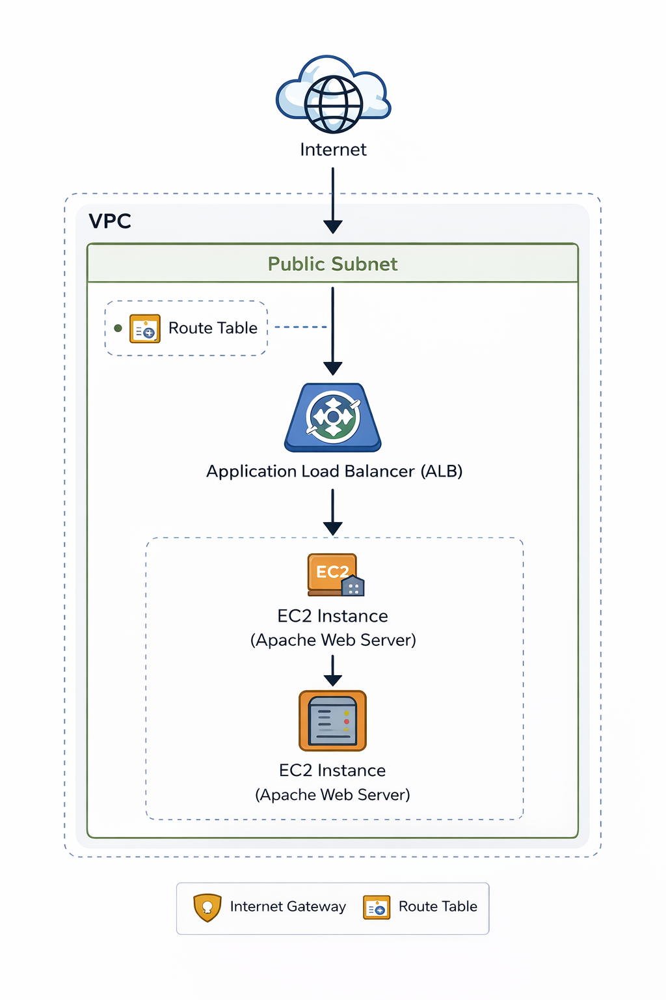

# 🚀 Terraform AWS Platform Infrastructure

Production-like AWS infrastructure built using Terraform.

---



---


## 🌐 Networking

- VPC with custom CIDR block
- Public subnet for ALB and EC2
- Internet Gateway attached to VPC
- Route table configured for internet access (0.0.0.0/0 → IGW)
- Security groups allowing HTTP (80) and SSH (22)
- ALB routing traffic to EC2 instance
---

## ⚙️ Tech Stack

- AWS (VPC, EC2, ALB, Security Groups)
- Terraform
- Linux (Amazon Linux 2)
- Apache (httpd)


---
## 📁 Project Structure

```
terraform-aws-platform-infra/

modules/
  vpc/
  alb/
  ec2/

environments/
  dev/

README.md
.gitignore
```

## 🚀 Features

- Custom VPC
- Application Load Balancer (ALB)
- EC2 with Apache web server
- Health checks
- Terraform modules

---

## ▶️ How to Deploy

```
cd environments/dev
terraform init
terraform apply
```
```
## 🌍 Result

Open in browser:

http://<alb_dns>
```

## 🧠 What I Learned
```
AWS networking (VPC, subnets, routing)

Load balancing (ALB)

Terraform modules

Debugging real cloud issues
```

```

## 🔧 Troubleshooting

Fixed ALB target group unhealthy

Fixed subnet routing issues

Fixed security group misconfigurations

Fixed EC2 user_data issues

```

## 📌 Future Improvements
```
Auto Scaling Group

CI/CD (GitHub Actions)

Monitoring (CloudWatch)
```